# How to avoid scam in crypto

Right now, there are too many scams in the crypto space and people are learning how to deal with them by being a victim of it.This website explain you what is cryptocurrency and how to buy it to ensure to avoid scams. It compare the different cryptocurrency platform to guide you to the platform that will be a good fit for your needs. Finally, you can report a scam that has happened to you. The report of the scam will be kept in the database and, in a futur update of the website, showned on the page for other user to find if they are going through the same scam that other have been through. This way the website will help newcomer into crypto to avoid scam when buying cryptocurrency and use the website as a reference when they get messages or emails that they believe are not trustable.

Copy past the website here

## Features

The website inform the viewers on the latest cryptocurrency hot topics and exchanges. For this reason, the website is being updated every 3 months to ensure it follows the fast cahnging world of cryptocurrency. 

The website is also a database of all the scams that viewers have reported. This database is going to be used for people who might me going through scam and want to confirm if anybody else went through this same scam.

### Existing Features

__Navigation Bar__

- You can find on all three pages the same menu which includes the small Blockchain logo for estetic only and then three links to the Home Page (What is Cryptocurrrency?), Buy page (Buy Crypto Safely) and Scam page (Report a Scam).

- This feature doesn't open the page on a different tab as each of the page has the top menu, this will ease the navigation of the viewers.

__Home page welcome image__

- The landing page image is showing bitcoin which is the most popular coin and an app with prices which catch the eyes to new buyer of cryptocurrency.

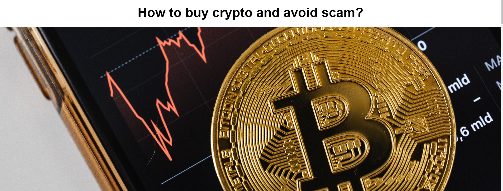

__what is crypto Section__

- This section is to explain in a very general view what is cryptocurrency.

- A picture on the side has been put of the side to catch the eyes of the viewer in an orginal way. The text is on the left and picture on the right which is opposite of the next look alike section (Type of token).

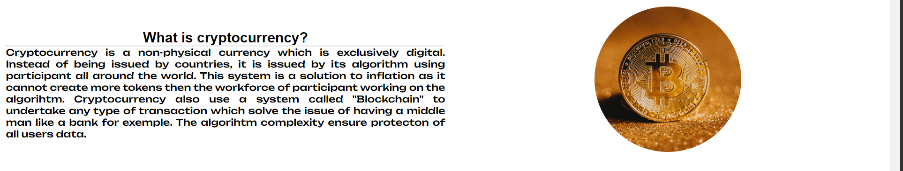

__Three sections__

- This section explain 3 really important definition that are not always understood in the crypto world. 

- The definitions are shorts and aim to get the viewers curious about the subject. They can then search for more details and get better informed. A futur update of the website aim to add more details on those concept.

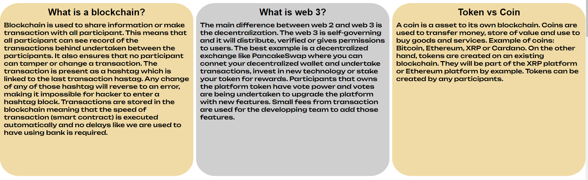

__type of token__

- this token is a introduction to the list of the token below it.

- It aims to catch the eye and like the "What is crypto section" show the website in an original way. As mention above, the text and image are opposite to the other section.

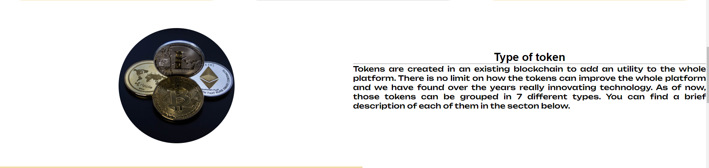

__list of token__

- The list of token follows the same patern of the Type of token and what is crypto section, they alternate left and right.

- The description are shorts and aim to get the viewers curious about the subject. Most of them have example so the viewers can understand better the concept and start to to know some of the tokens.

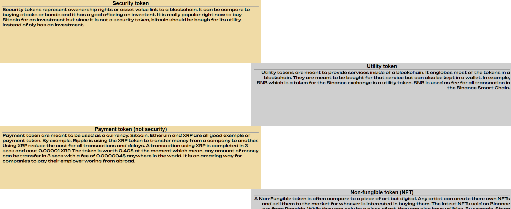

__footer__

- The footer has 4 usefull links: Coinmarketcap (Coins encyclopedia), Binance (Platform), Coinbase (Platform) and Ledger (Solution to store crypto safely). 

- Copyright have also been added into the footer.

__Buy Crypto welcome image__

- The image catch the eyes as it connect us dollars and bitcoin. It makes total sense as the next text on the page will be explaining how to buy crypto with a currency.

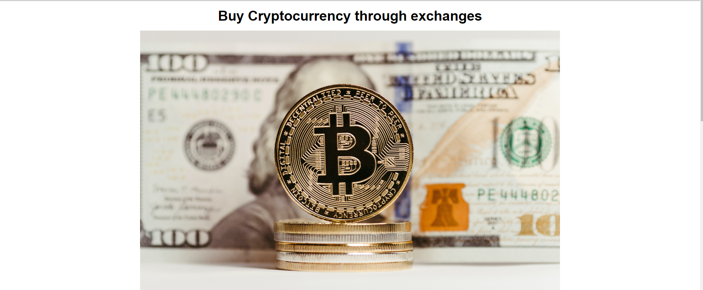

__Buy using an exchange__

- This section explain that the best way to buy crypto is by exchanges. It then explain that choosing a good exchange is really important.

- Three criterias are elaborated in this section which are also shown in the table below.

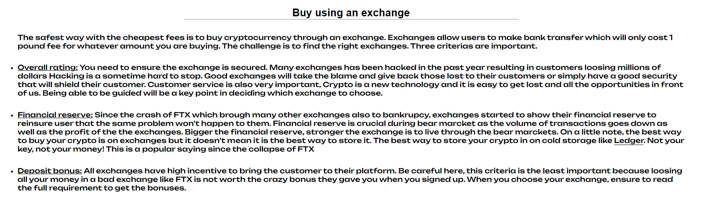

__Exchange table__

- To catch the eyes of the viewers and show the details of every exchange in a easy and simple way, a table is shown.

- Four datas are shown in the table: Exchange's name, Overall rating, Financial reserve and deposit bonuses.

- The viewers understand straight away the table has the data has been explained in the text just above it.

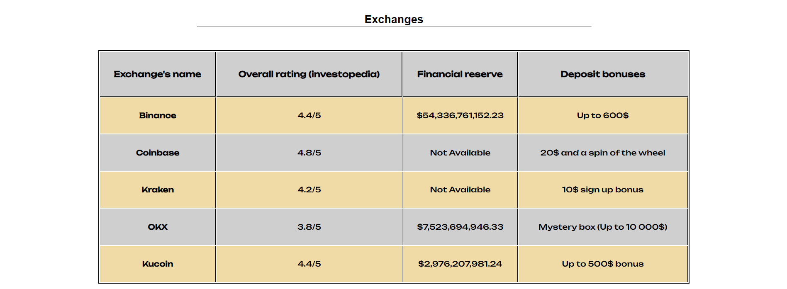

__Report a scam image__

- The welcome page covers all the whole page and catch the eyes as it is a bitcoin in the dirt. The dirt represent the though feeling of loosing money and being caught in a scam.

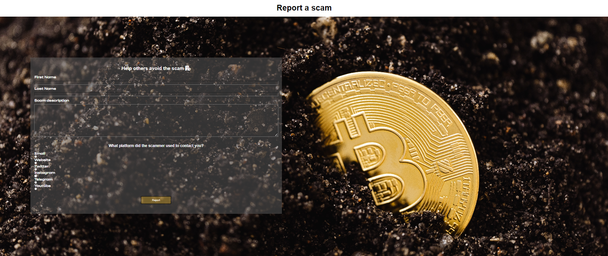

__Report a scam form__

- The form has four entries: First name, Last name, Scam Description and platform which the scam has happened.

- The reports are put in the database. In a futur update of the website, the scams will be shown on the website and an easy search option will be featured for anybody to check if they are going to the same scam that someone else has reported.

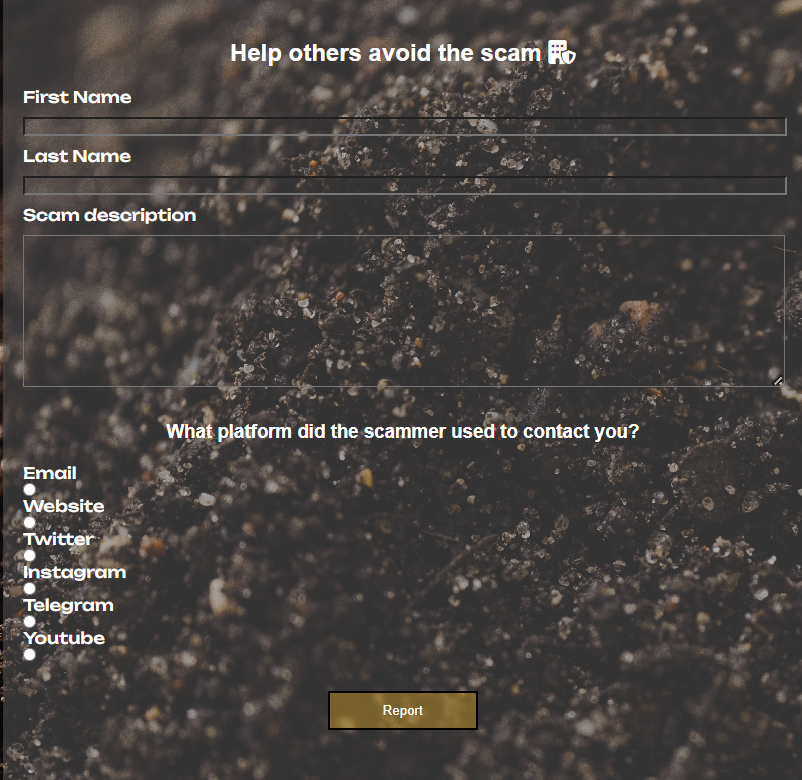

### Features left to implement

- The database of the scams shown dirrectly on the website.

- A search feature to find a scam from the database.

- A additional page explaining the main scams that are around in the crypto world.

## Testing

You can find below that all testing have been completed.

### Validator Testing

- HTML validator have been completed and all errors and waring have been fixed.

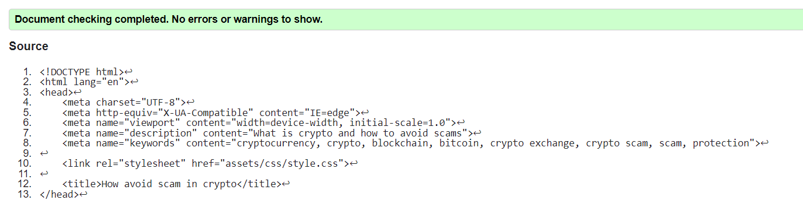

- CSS validator have been completed and no errors or warnings have been found.

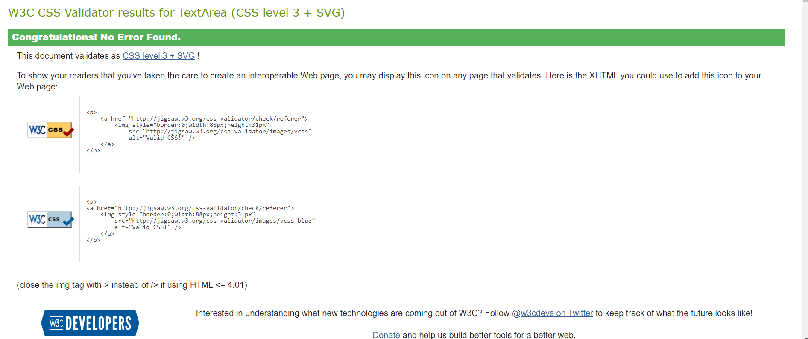

- Lighthouse has been run through all the pages, see the below result:

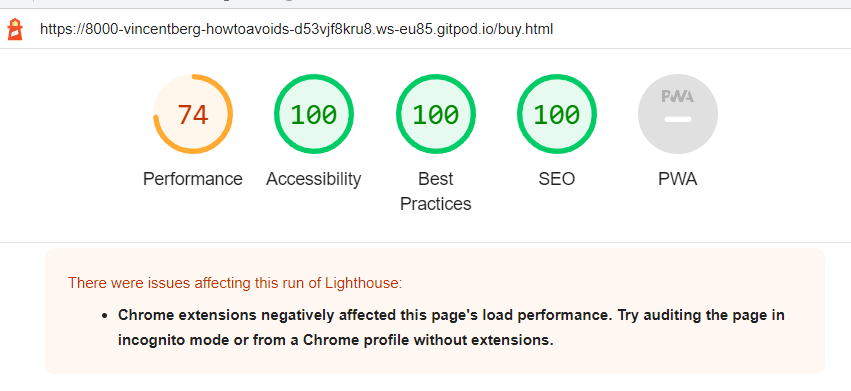

- The performance is the only assessment which has not achieved 100 points. Two main factors explain the lack of performance:

    - The size of the images is the main problem as it takes too long for the images to load. Smaller resolution of images should have been used for the website. This was the main problem of the performance and only that change will have boost greatly the performance.
    - The CSS files is too heavy. To achieve a perfect performance, CSS file should have been reduced.

### Unfixed Bugs

 - All bugs have been fixed. Performance could be upgraded by using smaller resolution pictures and by uptimizing the CSS file.

## Deployment

## Credits

### Content
### Media

## Other General Project Advice

